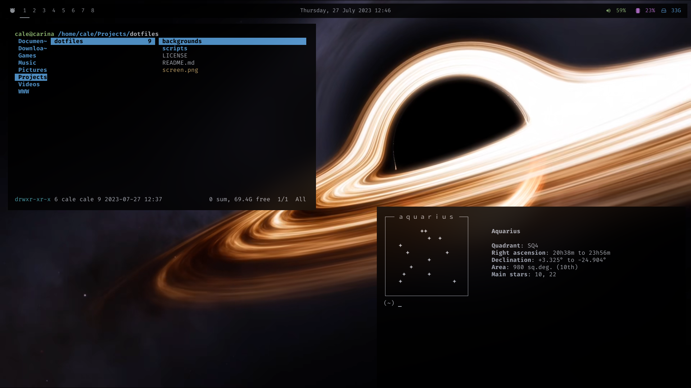

# About My System

This repository is my personal dotfiles. Dotfiles are the files responsible for customization on your BSD(Unix-like) system. This exists so that anyone can see how I have customized my system. The customization and configuration files on BSD(Unix-like) systems are referred to as dotfiles, because typically they begin with a period.

I am currently running FreeBSD. As you can see below I have started using bspwm. It is a feature rich tiling window manager that represents windows as the leaves of a full binary tree.

I do want to point out that my config is **not** tailored to suit a large number of people. Most likely you will need to change most configs to match monitor setups, personal preference, and directory structure.

## What I Use
- [bspwm](https://github.com/baskerville/bspwm/) (Window Manager)
- [polybar](https://github.com/polybar/polybar/) (System Bar)
- [rofi](https://github.com/davatorium/rofi) (Program Launcher)
- [cool retro term](https://github.com/Swordfish90/cool-retro-term) (Terminal)
- thunar (File Manager)
- lollypop (Music Player)
- [ncspot](https://github.com/hrkfdn/ncspot) (tui spotify client)
- feh (Setting Wallpaper)
- vlc (Video Player)
- firefox (Web Browsing)
- htop (System Monitoring)
- micro (Text Editor)
- ufs (File System)
- pulseaudio, oss (Audio)
- pavucontrol, pactl (Audio Control)
- zsh (User Shell)
- simplescreenrecorder (Recording Software)
- lxappearance (Theming)
- [catppuccin mocha](https://github.com/catppuccin/gtk) (gtk theme)

*Not all programs that I have listed here necessarily have configuration files stored here. This is just a mostly complete list of the programs I use.*

## What I Do Not Use
- login/display managers (I just use startx)
  
## Key Bindings:

My list of combinations:

    - Super + HJKL = Move Focus
    - Super + Shift + HJKL = Move Window
    - Super + s = Floating Window
    - Super + m = Toggle Monocle
    - Super + Return = Open Alacritty
    - Super + d = Open Rofi (Program Launcher)
    - Super + b = Open Firefox
    - Super + f = Open Thunar
    - Super + q = Kill Window
    - Super + Alt + q = Exit bspwm
    - Super + Alt + r = Restart bspwm

*For those new to tilers or maybe BSD(Unix-like) systems in general, Return is the Enter key & Super is the Windows Key*

---

*This README is modified from Zaney's dotfiles [here](https://gitlab.com/Zaney/dotfiles/)*
